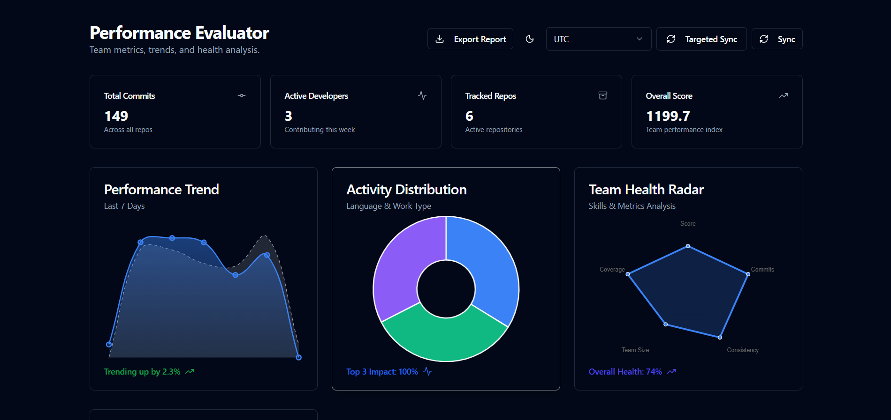

# Performance Evaluator

**Performance Evaluator** is a comprehensive full-stack application designed to track, analyze, and visualize developer performance metrics. It aggregates data from version control systems (Git) and coding activity trackers (Wakatime) to provide deep insights into team health, individual contributions, and productivity trends.



## 🚀 Features

-   **Team Health Radar**: Visualize team balance across 5 key dimensions: Score, Commits, Consistency, Team Size, and Coverage.
-   **Performance Trends**: Week-over-week comparison of team output aligned by day of week.
-   **Interactive Dashboard**: Drill down into specific days, developers, or metrics with detailed modals.
-   **Daily Comparison Mode**: Side-by-side comparison of team metrics for any two selected dates.
-   **Export Reports**: Generate professional PDF or Excel reports for stakeholders.
-   **Activity Archive**: specialized view for historical data analysis.
-   **Developer Scoring System**: Automated scoring based on commits, code churn, focus time, and more.

## 🛠 Technology Stack

### Backend
-   **Python 3.12+**
-   **FastAPI**: High-performance web framework.
-   **SQLAlchemy**: ORM for database management.
-   **SQLite**: Lightweight, zero-configuration database (easy to swap for PostgreSQL).
-   **Pandas / Matplotlib**: For data analysis and chart generation in reports.

### Frontend
-   **Vue 3 (TypeScript)**: Reactive frontend framework.
-   **Vite**: Next-generation build tool.
-   **Shadcn-vue**: Accessible and customizable UI components.
-   **Tailwind CSS**: Utility-first CSS framework.
-   **Chart.js**: Interactive charting library.

## 📦 Installation & Setup

### Prerequisites
-   Python 3.12 or higher
-   Node.js 18 or higher
-   Git

### 1. Clone the Repository
```bash
git clone https://github.com/yourusername/performance-evaluator.git
cd performance_optimizer
```

### 2. Backend Setup
Navigate to the backend directory and set up the Python environment.

```bash
cd backend
python -m venv venv
# Activate virtual environment:
# Windows:
.\venv\Scripts\activate
# Linux/Mac:
source venv/bin/activate

# Install dependencies
pip install -r requirements.txt
```

**Configuration**:
Create a `.env` file in the `backend` directory:
```env
DATABASE_URL=sqlite:///./performance.db
WAKATIME_API_KEY=your_global_key_here_if_needed
GITHUB_TOKEN=your_github_token_for_higher_rate_limits
```

**Run the Server**:
```bash
uvicorn main:app --reload --port 8000
```
The API will be available at `http://localhost:8000`.

### 3. Frontend Setup
Open a new terminal and navigate to the frontend directory.

```bash
cd frontend
npm install
```

**Run the Application**:
```bash
npm run dev
```
The application will launch at `http://localhost:5173` (or similar).

## 📊 Usage Pattern

1.  **Add Developers**: Go to the sidebar and add developers with their Git usernames.
2.  **Sync Data**: Click the "Sync" button to fetch recent activity.
3.  **Analyze**: View the dashboard for trends and insights.
4.  **Export**: Use the "Export" button to download monthly or weekly reports.

## 📄 License

This software is licensed under a **Non-Commercial License**. See the [LICENSE](LICENSE) file for details.
You are free to use, modify, and distribute this software for personal, educational, or non-profit purposes. 
**Commercial use is strictly prohibited** without prior permission.